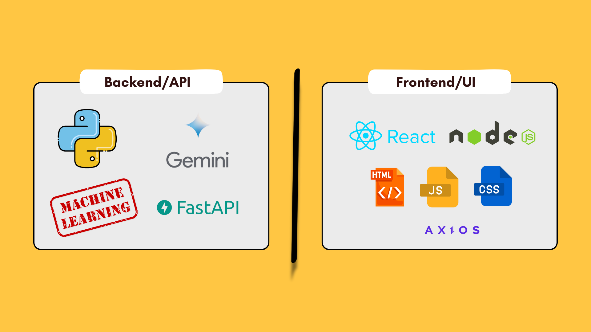
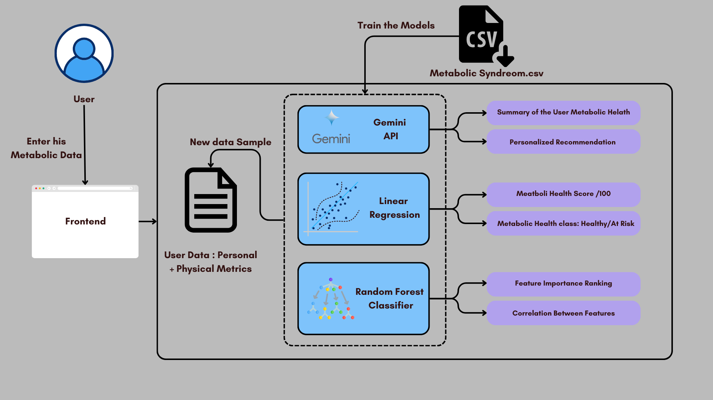

# GLUCE: Personalized Metabolic Health Assessment Web App 🚀

## 🎯 Objective

The goal of this web app is to provide individuals with personalized metabolic health assessments and predictions using **AI and machine learning** algorithms. The app analyzes user data to predict potential health risks—such as metabolic syndrome—and offers actionable insights to improve overall metabolic health.

## 👥 Target Audience

- **Individuals:** Those looking to understand and monitor their metabolic health, especially if they're at risk for conditions like diabetes, heart disease, or obesity.
- **Healthcare Professionals:** Providers seeking tools to assess metabolic health risks and support clinical decision-making.

## 💡 Inspiration: Why Metabolic Health?

Over the past few months, I've been deeply interested in metabolic health and the profound impact of nutrition on overall performance, mood, and long-term wellbeing. Healthy nutrition and an optimized metabolism not only boost energy and mood but also play a critical role in preventing severe conditions later in life.
You wanna learn more about metabolic health check up the following podcasts:
- https://youtu.be/3esF-pNAM9c?si=liRj7uursKMhGoFi
- https://youtu.be/4DWKf5RqU-s?si=ngHFUUcoNVZ0ae-J

**Definition:**  
*Metabolic health is the body's ability to efficiently convert food into energy at the cellular level. This fundamental process fuels every function in our body, impacting not just weight and energy levels but also long-term health. When metabolism is optimized, it supports cardiovascular function, brain health, and hormone balance. However, poor metabolic health is linked to serious conditions like obesity, type 2 diabetes, Alzheimer's, dementia, depression, and heart disease. By understanding and improving metabolic health, we unlock the key to vitality, longevity, and disease prevention.*

## 🔍 Project Overview

GLUCE is a full-stack web application that integrates a React-based frontend with a FastAPI backend powered by several machine learning models:

- **Regression Model:** Generates a metabolic health score.
- **Classification Model:** Categorizes patients as healthy, at risk, or high risk.
- **Gemini Model:** Produces personalized recommendations and a comprehensive summary of overall metabolic health.
- **Random Forest Model:** Ranks feature importance and determines the correlation between features.

All these results are showcased in a beautifully designed user interface.

## 🛠️ Tech Stack

- **Frontend:** React, HTML, CSS, JavaScript
- **Backend:** Python (FastAPI)
- **Machine Learning:** Regression, Classification, Gemini, and Random Forest models

### Diagrams

- **Stack Diagram:**  
    
  *Figure 1: Frontend and Backend Stack*

- **Workflow Diagram:**  
    
  *Figure 2: App Workflow – User enters data, backend processing, and UI display*

## 📊 Dataset Features and Explanations
Dataset Source: https://github.com/YBilodeau/Metabolic-Syndrome-Prediction-Project?tab=readme-ov-file

The dataset used in the project includes the following features:

- **Age:** The individual's age in years.
- **Sex:** The biological gender (e.g., male or female).
- **Marital:** Marital status (e.g., single, married, divorced).
- **Income:** The individual's income level.
- **Race:** The ethnic background.
- **WaistCirc:** Waist circumference measurement, indicating abdominal fat.
- **BMI:** Body Mass Index, calculated from weight and height.
- **Albuminuria:** Presence of albumin in urine, an indicator of kidney issues.
- **UrAlbCr:** Urinary Albumin-to-Creatinine Ratio, used to assess kidney function.
- **UricAcid:** Uric acid levels in the blood, relevant for conditions like gout.
- **BloodGlucose:** Blood sugar levels, important for diagnosing and monitoring diabetes.
- **HDL:** High-density lipoprotein cholesterol, the "good" cholesterol.
- **Triglycerides:** A type of blood fat; high levels can indicate heart disease risk.

## 🔄 How It Works

1. **User Input:**  
   The user enters their health data through the frontend.
2. **Backend Processing:**  
   - The **regression model** calculates a metabolic health score.
   - The **classification model** categorizes the patient as healthy, at risk, or high risk.
   - The **Gemini model** generates tailored recommendations and summarizes overall metabolic health.
   - The **random forest model** ranks feature importance and assesses correlations.
3. **UI Display:**  
   All the results are presented through an intuitive and beautiful user interface.

